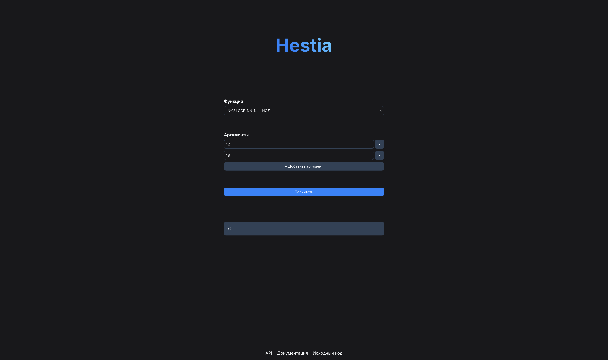

# hestia-web

Веб-интерфейс и REST API Hestia.



## Локальный запуск

1. Загрузите OCI-образ:

```sh
docker pull ghcr.io/moevm4388/hestia-web:latest
```

2. Запустите контейнер:

```sh
docker run -p 8000:80 ghcr.io/moevm4388/hestia-web:latest
```
